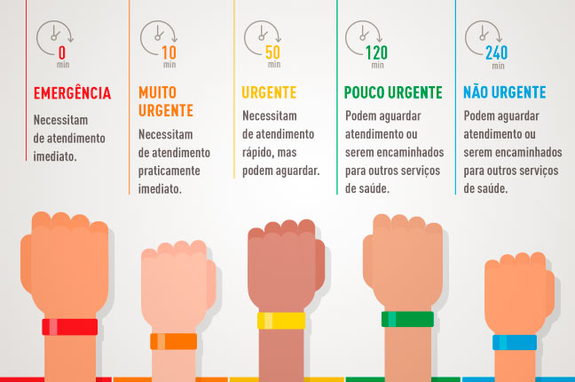
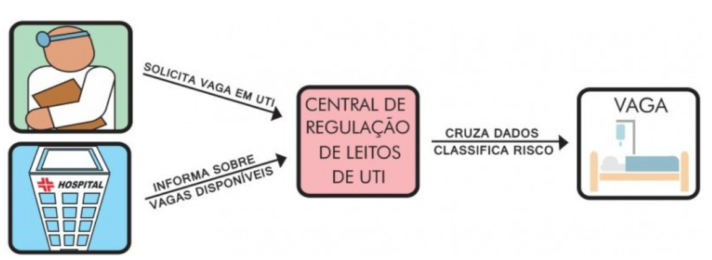
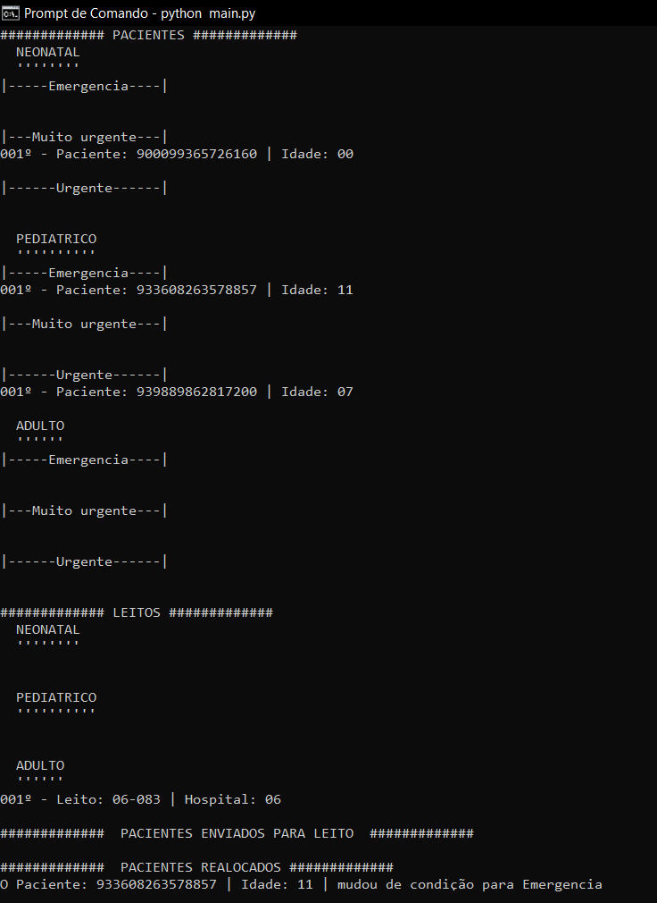

# Problema 2 - Regulação de Leitos de UTI

## Introdução:
O presente trabalho visa a resolução do problema proposto acerca da regulação de leitos de UTI. Cruzando dados de demanda e disponibilidade de leitos, foi solicitado um programa que pudesse organizar pacientes e leitos, alocando os pacientes ccom prioridade, com pior condição de saúde seguindo o protocolo de Manchester, e em seguida o seu tempo de espera, designando esses pacientes aos leitos de mesma categoria que foram recentemente liberados. As categorias de leitos são divididas em Neonatal, Pediátrica e Adulta, que correspondem a pacientes com menos de 1 ano de idade, de 1 ano até 13 anos de idade e acima dos 13 anos de idade, respectivamente. Além disso, o protocolo de Manchester divide os paciente em *Emergência*, *Muito Urgente*, *Urgente*, *Pouco Urgente* e *Não Urgente*, entretanto, os dois últimos não necessitam de vagas em UTI, logo, foram excluídos da resolução desse trabalho. Para testar a regulação, solicitou-se uma simulação de demandas e disponibilidades de leitos que chegassem aleatoriamente.

*Figura 1 - Representação do protocolo de Manchester*

## Escolha de algoritmos e estruturas:
Com o intuito de facilitar o controle de pacientes e leitos, diversas classes foram projetadas.

### Pacientes
Esta classe permite que atributos fossem designados a cada paciente, facilitando, deste modo, a manipulação de demandas de leitos.
### Leitos:
Com o mesmo intuito da classe de pacientes, esta permite a manipulação da disponibilidade de leitos.
### Fila de pacientes:
Como os pacientes são alocados aos leitos respeitando o seu tempo de espera, a TAD fila é a mais apropriada, na qual a ordem de saída de objetos da fila respeita o tempo do objeto dentro da fila, saindo primeiro aqueles que chegaram mais cedo. Entretanto, como um auxilio à uma das solicitações do problema, foi adicionado um método que pudesse remover um objeto, isto acontece quando um paciente muda de condição de saúde, mudando também de fila. Para a resolução desta TAD, foi utilizado uma lista encadeada, pois como o primeiro da fila é sempre removido, não é necessária a realocação de posição de todos os outros objetos, apenas é tirado a conexão entre o primeiro e o segundo, o mesmo funciona quando um objeto é tirado do meio da fila, a realocação de objetos não é necessária, neste caso, o objeto que apontava para o removido, passa a apontar para o proximo do que foi removido. 
### Pilha de leitos:
O problema requeria que os leitos atribuidos fossem aqueles mais recentemente liberados. Desse modo, a TAD escolhida é pilha e para a resolução desta classe foi utilizado um vetor com tamanho máximo. Em primeiro ponto, o número de leitos em um estado é limitado, e isso ficou nítido durante a pandemia, na qual era necessária uma boa regulação do número de leitos para atribuir aos pacientes com mais necessidade. Em segundo, a implementação de um vetor é mais fácil do que a de uma lista encadeada e como o ultimo objeto que foi colocado será aquele a sair, não é necessario a realocação de posições dos objetos da pilha em nenhum momento.
### Lista:
Esta classe é muito simples, sem a necessidade de remoção de objetos. A lista foi projetada apenas para auxiliar o controle das pilhas e dos leitos, além da atribuição de pacientes aos leitos corretos. Foi utilizado uma lista encadeada. 
### Nó:
Esta classe tem o único propósito de auxiliar listas encadeadas.

## Simulação:
A simulação gera pacientes com ids únicos para o programa, isto é feito seguindo o padrão do *CNS* em que um id com 15 dígitos aleatórios é gerado, sendo as chances de dois ids iguais cairem é de uma em 10 elevado a 225, praticamente zero, são gerados também uma faixa de idade e estado de saúde aleatórios, estes dois tem as mesmas chances para todos os casos. Pórem, existe uma probabilidade do paciente não ser gerado, neste caso, foi atribuída uma constante v_p que é dada em porcentagem. Nos casos testes que eu fiz, utilizei 80%, com o intuito de observar maior manipulação de pacientes. Esta função representa a solicitação de vagas de leito.
Além disso, também é gerado um leito, com id único na forma 12 - 345, com os dois primeiros dígitos representando o hospital a qual o leito pertence, assim, as chances de dois leitos iguais serem gerados é de 1 em 10 elevado a 25, ou seja, quase zero. Ademais, também é elaborada uma categoria aleatória pro leito, sendo 0 ---> Neonatal,    1 ---> Pediátrico e 2 ---> Adulto. Como na geração de pacientes, nesta também existe uma constante v_l em porcentagem que representa as chances de um leito ser gerado. Utilizei em 60% para que o número de pacientes gerados fossem maior que os de leitos, desse modo havendo maior número de pacientes aguardando em fila e sofrendo alterações. Esta função representa a disponibilização de leitos.
Por último, uma função que muda o estado de um paciente, pertencente a uma fila aleatoriamente. Esta função representa as chances de um paciente mudar de condição enquanto aguarda em sua fila. Nela, um paciente pode melhorar ou piorar a depender de seu estado de saúde atual, em que quanto mais grave maiores as chances de piorar e menores de melhorar.

## Central de Regulação de Leitos de UTI:

*Figura 2 - Esquema de funcionamento de uma central de regulação de leitos de UTI.*

Algumas convenções foram tomadas para facilitar o desenvolvimento do código, como os níveis de prioridade, ou seja, a condição de saúde do paciente, são estes *0*, *1* e *2*, representando *Urgente*, *Muito Urgente* e *Emergência*, respectivamente. Caso a prioridade ultrapasse o valor 2, o paciente será dado como falecido, e se for menor que 0, como *Não Urgente*. Nestes dois casos, o paciente é retirado do controle. Em relação à idade do paciente, aqueles com menos de um ano de idade, ou seja *Neonatais* tem como idade 0 anos. 
Este programa está contido principalmente no arquivo central.py, possuindo as seguintes funções:
### lista_f:
Esta função cria as 9 possibilidades de filas de pacientes dentro de uma única lista.
### lista_p:
Esta função cria as 3 possibilidades de pilhas de leitos dentro de uma única lista.
### atribui_p:
Aloca o paciente requerendo vaga de UTI para a sua fila correta, respeitando a faixa etária e a prioridade do paciente.
### atribui_l:
Aloca o leito disponível para a sua pilha correta, respeitando a categoria.
### reatribui_p:
Caso um paciente tenha seu estado de saúde alterado enquanto aguarda em fila, esta função receberá esse paciente e irá atribuir este paciente ao final de sua nova fila, respeitando a nova prioridade e a faixa etária. 
### aloca:
A função mais importante para a regulação de UTIs, esta verifica a disponibilidade e a solicitação de vagas de leitos. Caso as duas se cruzem, o paciente será removido da fila, e o leito de sua pilha, e serão alocados a uma lista. Nesta lista, os pacientes apontam para ao seu respectivo leito atribuído, a partir de um nó.

O código a ser rodado está no arquivo main.py, este cruza a central com o simulador para unir a chegada de pacientes e leitos, e mostra o funcionamento das classes e funções criadas. Neste também consta a organização da interface impressa no terminal, para o usúario poder acompanhar a realização dos processos. É importante salientar que todo o processo está contido dentro de um loop infinito, que a cada ciclo pode gerar um único paciente e/ou um único leito, ou nenhum dos dois. Ao final de cada ciclo, será feita uma impressão no terminal contendo as informações de fila, pilha, alocações de pacientes e mudança de prioridade. Para seguir para o próximo ciclo, é necessário pressionar a tecla *ENTER*.

*Figura 3 - Print da saída do código no terminal*

